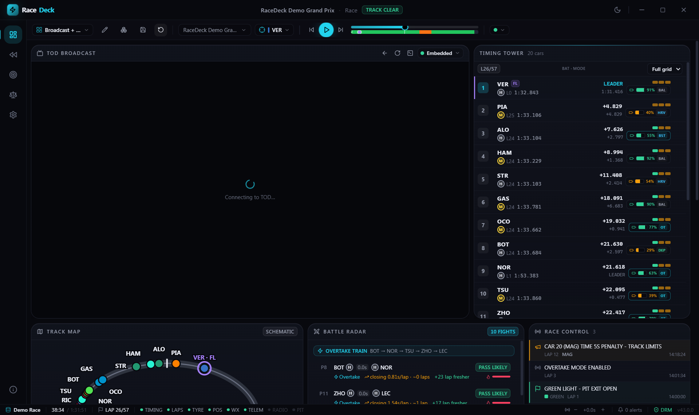
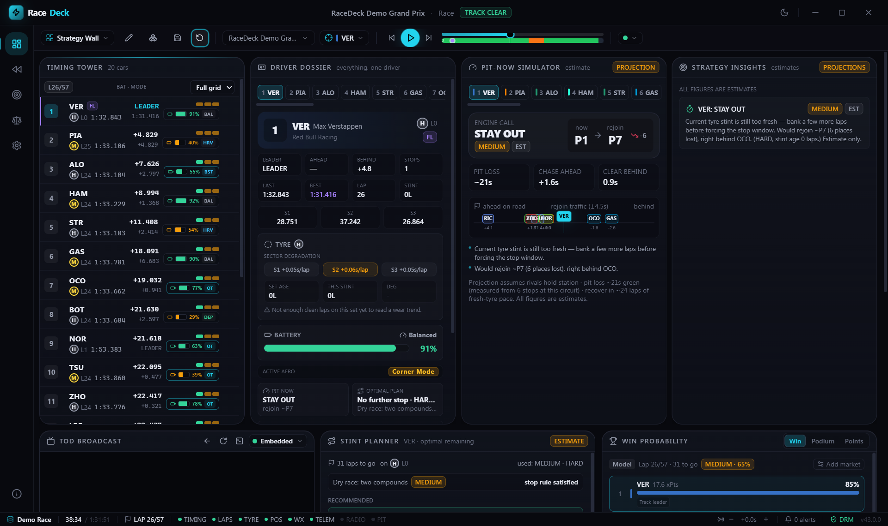

# RaceDeck

RaceDeck is a desktop app for watching Formula 1 that pairs a legal video surface for TOD (the beIN streaming service) with a live timing and strategy dashboard, so you can watch the race and read the data side by side instead of switching between a stream and a stats site.



The Broadcast + Data layout in the offline Demo Grand Prix. The video area on the left is where the TOD surface goes; in demo mode there is no login, so it just shows "Connecting to TOD".



The Strategy Wall layout, with the Pit-Now Simulator, Stint Planner, Strategy Insights and Win Probability panels reading the same demo race.

## Why I built it

I wanted something like MultiViewer, but built around race strategy rather than just timing: a workspace where the pit-stop math, tyre degradation and win probability update live next to the video, and where I could add whatever panel I was missing instead of being stuck with a fixed layout. It's also an excuse to work with real F1 timing data and with Electron's less common APIs (DRM, `WebContentsView`, session partitions).

## What it does

- Reads Formula 1's own public timing feed, the same one MultiViewer and FastF1 use, for both replaying any past session and following a live one.
- Ships a bundled offline "Demo Grand Prix" so the whole app, including the strategy math, works with no network and no F1 session running.
- Six layout presets (Broadcast + Data, Driver Focus, Strategy Wall, Qualifying Pro, Practice Lab, Minimal Watch) built from a few dozen widgets you can freely add, remove and rearrange: timing tower, track map, tyre strategy, gap/lap charts, race control, weather, and more.
- A Pit-Now Simulator that projects what happens if a driver boxes this lap (rejoin position, gap to the leader, undercut viability), and a Stint Planner that searches 0/1/2-stop strategies over a pace-and-degradation model fitted from the event's own laps.
- A Pace Battle panel, a Battle Radar for on-track fights, and a Race Story panel that narrates the race as it plays.
- A field-wide Pit Event Log that lists every stop up to the current playback time and shows a dash for anything the feed did not report, instead of guessing.
- A win-probability model (win / podium / points chance per driver) with an optional, opt-in overlay of public Polymarket odds for comparison.
- An "AI Race Engineer" that answers strategy questions in plain language, using a provider key you supply yourself (free tiers exist for Gemini and Groq).
- A sync system to line the dashboard up with a delayed broadcast, since TOD's video isn't frame-accurate with the timing feed.

## How it works

The app is Electron, split the normal way: the main process owns the TOD video surface and the F1 login, the renderer is a React/TypeScript app with Zustand stores and ECharts for the charts, and `shared/` holds the plain data models both sides agree on.

The interesting part of the main process is `VideoSurfaceManager`. TOD is loaded in its own `WebContentsView` (a full browser view, not an iframe), so it behaves exactly like opening the site in a normal browser tab. If embedding fails on a given machine (missing Widevine, a hard load failure), it falls back to a companion window and then to opening TOD in the default browser, and tells you which mode it's in. RaceDeck never touches TOD's DRM, cookies or license traffic directly; it just watches high-level navigation and playback events.

`F1LiveService` fetches Formula 1's archive and live timing feeds, decodes the zlib-compressed telemetry/position streams, and streams the parsed data to the renderer as it arrives rather than waiting for the whole session to download. The track map can render as soon as one closed lap of position data exists. Live sessions poll incrementally and only process newly appended points, which keeps the per-poll cost flat over a full race. Login for the gated live data (car positions, telemetry) happens in F1's own login page inside the app; RaceDeck only reads back the token it needs to open the feed, never the password.

All of the strategy analytics (`StrategyEngine`, `WinProbabilityEngine`, `BattleEngine`, `RaceStoryEngine`, the fuel/degradation model) are pure, deterministic functions with their own unit tests, and everything they produce is labeled as an estimate rather than presented as certain. The AI Race Engineer is built on top of the same numbers: it's given a compact summary of the current snapshot and instructed to reason only from that context, so it interprets the strategy engine's output instead of inventing lap times or gaps of its own.

Recent work was mostly about making the app fail safely rather than adding screens:

- Every IPC call from the renderer is validated in the main process, and only the app's own window is allowed to use the privileged bridge. External links go through an allow-list.
- The AI API key is encrypted on disk with the operating system's `safeStorage` (DPAPI on Windows) instead of being stored as plain text. If it can't be decrypted it is treated as missing, never deleted.
- If the settings file is corrupt, it is moved aside as a `.corrupt-<timestamp>` copy and the app starts clean rather than crashing. Settings can also be exported and imported from the Settings page.
- Each widget sits inside its own error boundary, so one broken panel shows an error card and the rest of the dashboard keeps working.
- The data layer was split into smaller modules (normalisation, feed-quality checks, strategy engines), and the timing tower marks drivers whose feed has gone stale.

## Running it

Requires Node.js 22.12+.

```bash
npm install       # also downloads Electron the first time
npm run dev       # starts the app with hot reload
npm run typecheck
npm run build
npm test          # Vitest unit suite (2119 tests in 160 files at the time of writing)
npm run test:e2e  # Playwright (run npm run build first)
```

`npm run dev` uses stock Electron, which can't decode DRM-protected video, so TOD opens in External mode (your normal browser) by default. To test embedded/companion playback, run `npm run enable-drm` once to install the castLabs Widevine-capable Electron build the project pins, then `npm run dev` again. Real commercial-grade playback additionally needs VMP signing (`npm run build:win:vmp`), which is documented in the source but not something I've needed for day-to-day development.

## About the F1 data and the legal side

Formula 1 publishes a real-time timing feed that isn't part of any official developer program, but is public, requires no login, and is the same one tools like MultiViewer and FastF1 already build on. Replaying a past session reads that open archive directly. Following a live session over the modern SignalR endpoint gives you basic timing for free; the gated parts (live car positions, telemetry, Driver Tracker) only unlock if you sign in with your own F1 TV subscription, which you do on F1's real login page inside the app.

TOD is the paid video product this pairs with, and RaceDeck deliberately does not try to get around its protections: it opens a normal, user-authenticated browser surface, lets you log in as you would in any browser, and only watches for navigation and playback events to drive its own UI. It doesn't extract stream URLs, read license keys, or store your credentials anywhere RaceDeck controls, and that is handled entirely by Chromium's own session storage. RaceDeck isn't affiliated with Formula 1, TOD, beIN, OpenF1, or any AI provider, and any AI or prediction-market key/data you add is opt-in and stays local to your machine.

## Limitations and what I'd add next

- Position Trend is currently derived from completed lap times rather than a live per-lap classification feed, so it's a slight approximation during a session.
- OpenF1's high-rate telemetry (`car_data`/`location`) isn't bulk-fetched because of its size; the UI reports honestly when that data isn't available rather than guessing.
- 2026-era battery state and deploy modes are modelled and clearly marked as estimates, since the public feed doesn't expose real state of charge.
- Production DRM packaging (castLabs build + VMP signing) is a separate, more fragile step from normal development, and I'd like to simplify it.
- On the roadmap: a real x/y track map once I wire up live position data properly, and multi-monitor docking for the companion video window.
